# Fast Style Transfer

A tensorflow implementation of fast style transfer described in the papers:
* [Perceptual Losses for Real-Time Style Transfer and Super-Resolution](http://cs.stanford.edu/people/jcjohns/eccv16/) by Johnson
* [Instance Normalization](https://arxiv.org/abs/1607.08022) by Ulyanov

I recommend you to check my previous implementation of [A Neural Algorithm of Artistic Style](https://arxiv.org/abs/1508.06576) (Neural style) in [here](https://github.com/hwalsuklee/tensorflow-style-transfer), since implementation in here is almost similar to it.  

## Sample results

All style-images and content-images to produce following sample results are given in `style` and `content` folders.

### Chicago
Following results with `--max_size 1024` are obtained from *chicago* image, which is commonly used in other implementations to show their performance.

Click on result images to see full size images.

<p align='center'>

</p>
<p align='center'>
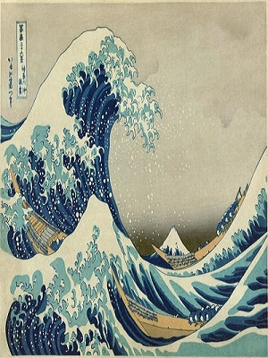
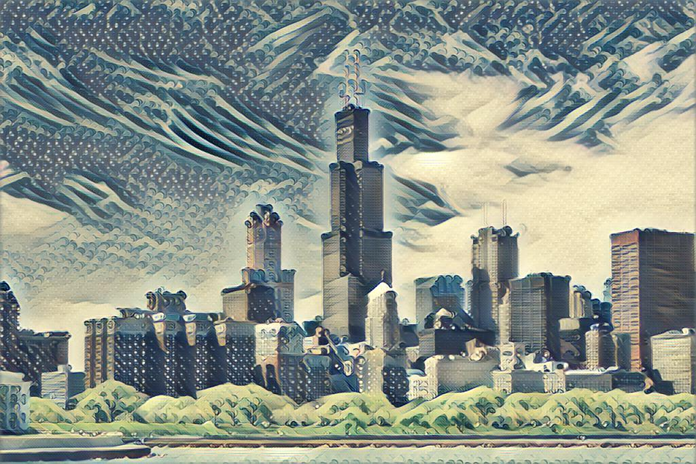
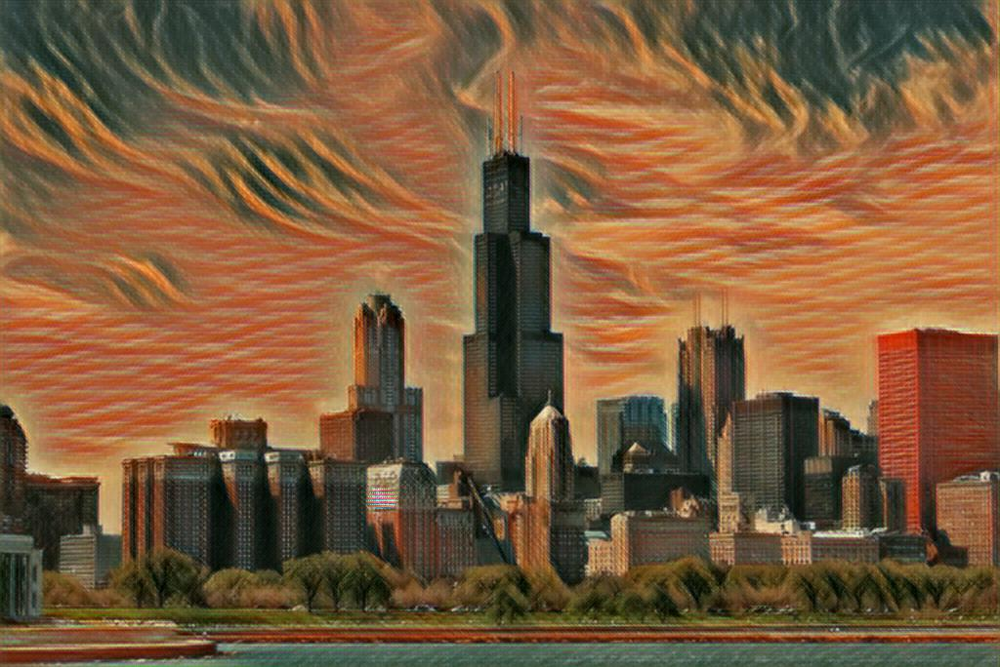
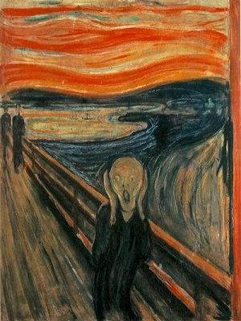
<br>
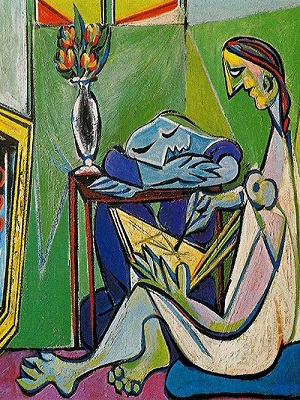
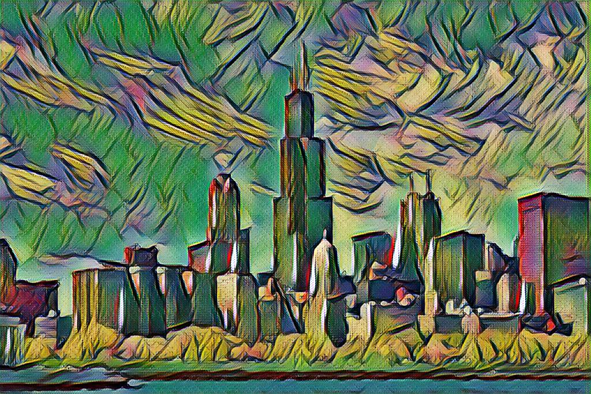
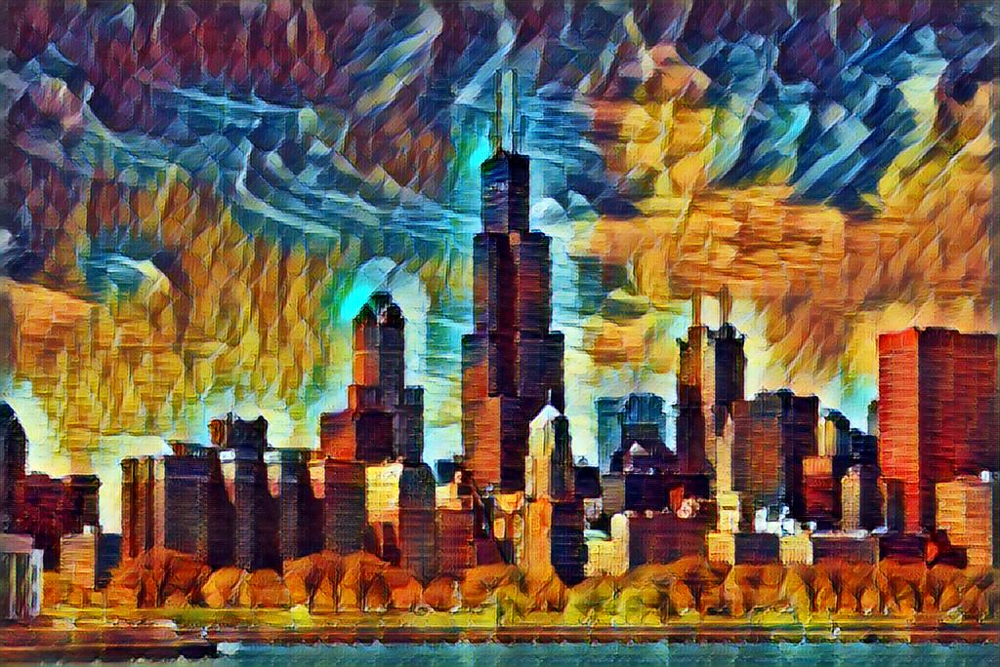

<br>
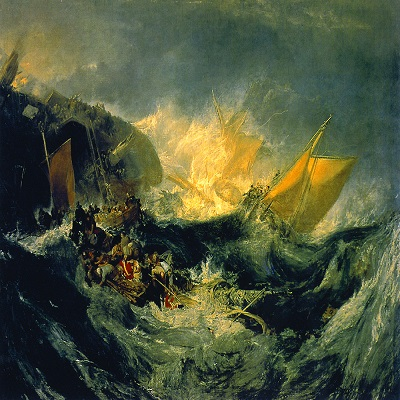
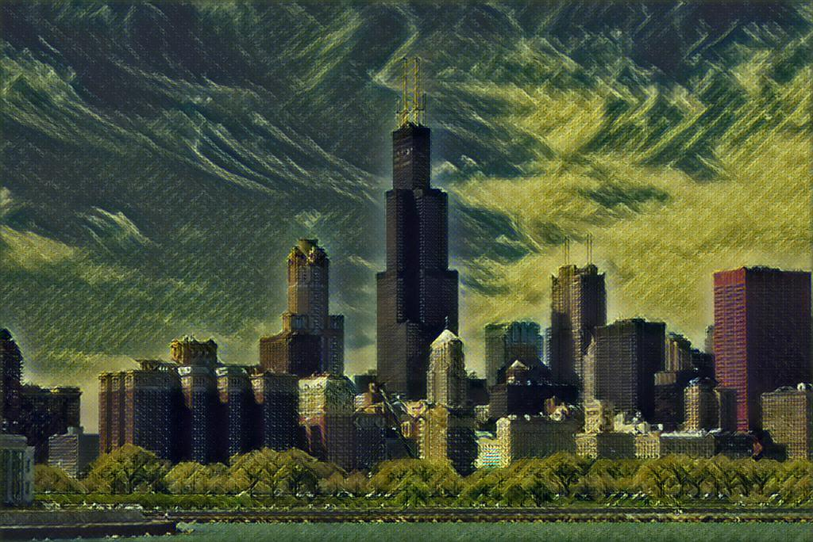
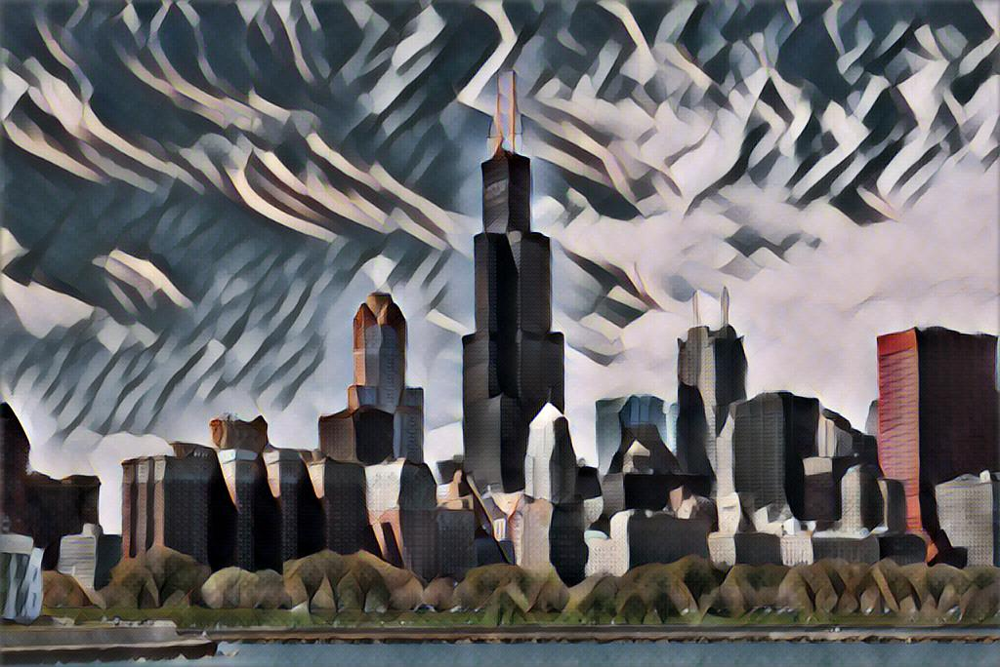

<br>
</p>

### Female Knight
The source image is from https://www.artstation.com/artwork/4zXxW

Results were obtained from default setting except `--max_size 1920`.  
An image was rendered approximately after 100ms on  GTX 980 ti.

Click on result images to see full size images.

<p align='center'>
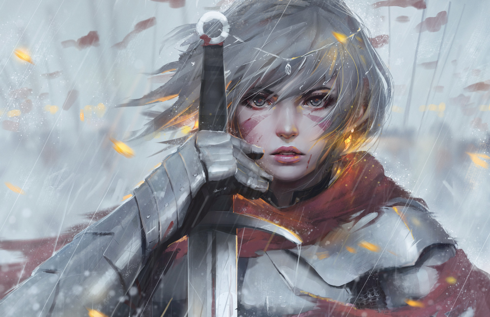
</p>
<p align='center'>


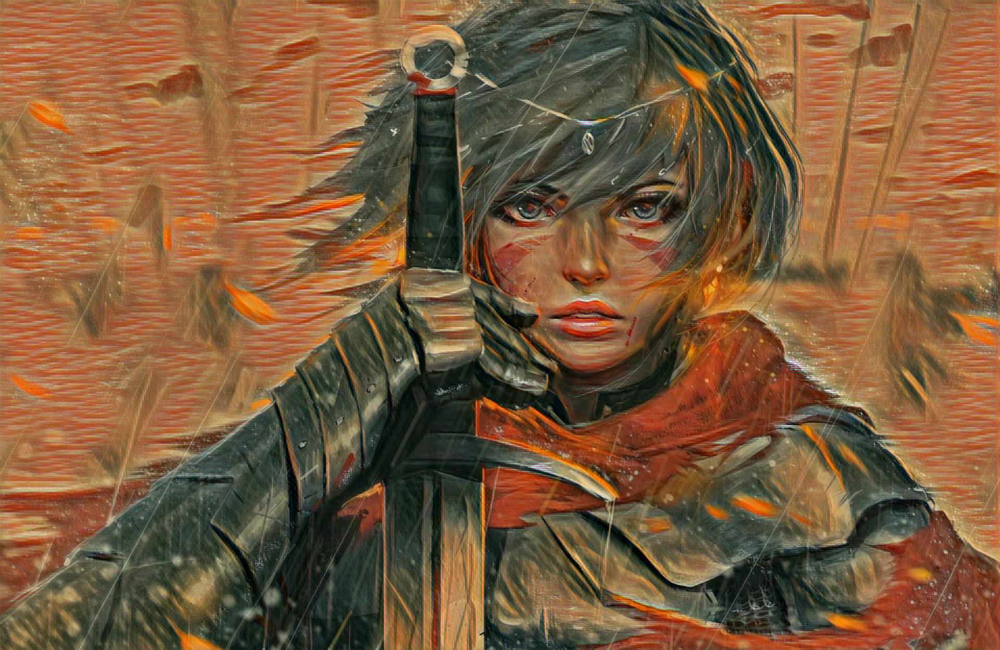

<br>

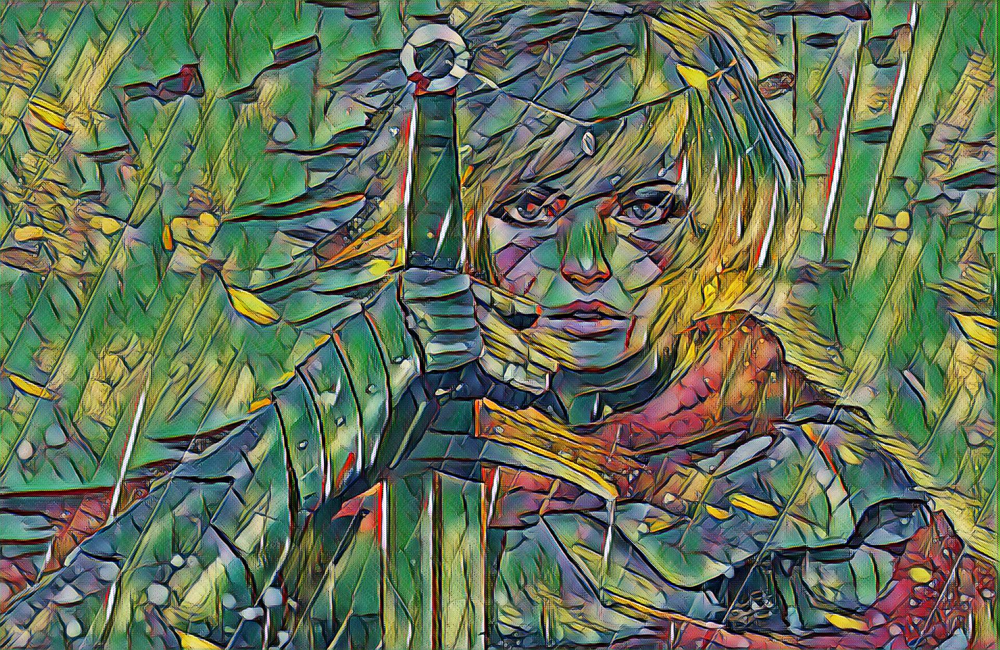
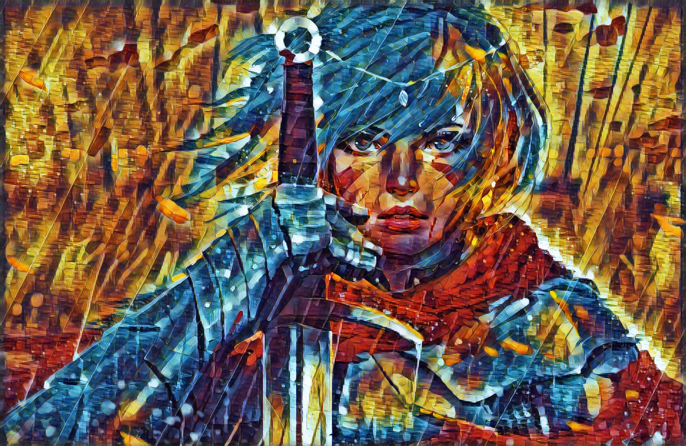

<br>

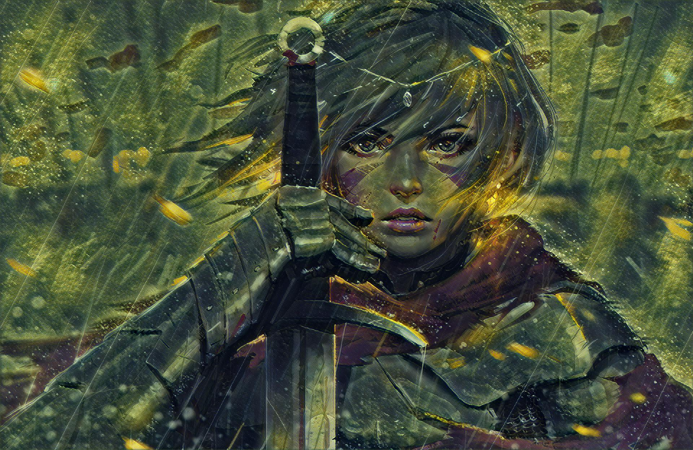
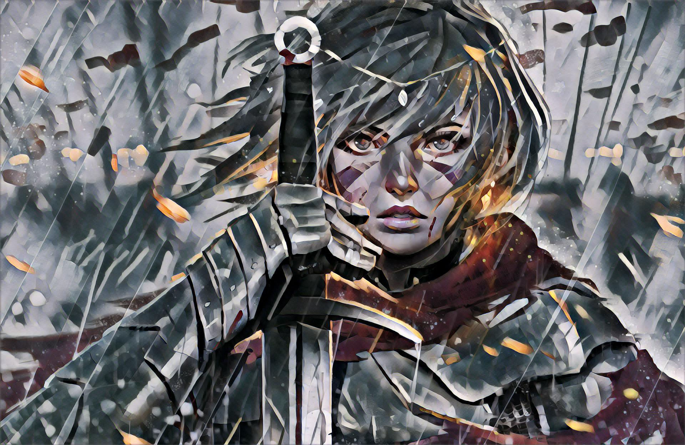

<br>
</p>

## Usage

### Prerequisites
1. Tensorflow
2. Python packages : numpy, scipy, PIL(or Pillow), matplotlib
3. Pretrained VGG19 file : [imagenet-vgg-verydeep-19.mat](http://www.vlfeat.org/matconvnet/models/imagenet-vgg-verydeep-19.mat)  
&nbsp;&nbsp;&nbsp;&nbsp;&nbsp;&nbsp;* Please download the file from link above.  
&nbsp;&nbsp;&nbsp;&nbsp;&nbsp;&nbsp;* Save the file under `pre_trained_model`  
4. MSCOCO train2014 DB : [train2014.zip](http://msvocds.blob.core.windows.net/coco2014/train2014.zip)  
&nbsp;&nbsp;&nbsp;&nbsp;&nbsp;&nbsp;* Please download the file from link above.  (Notice that the file size is over 12GB!!)  
&nbsp;&nbsp;&nbsp;&nbsp;&nbsp;&nbsp;* Extract images to `train2014`.

### Train
```
python run_train.py --style <style file> --output <output directory> --trainDB <trainDB directory> --vgg_model <model directory>
```
*Example*:
`python run_train.py --style style/wave.jpg --output model --trainDB train2014 --vgg_model pre_trained_model`

#### Arguments
*Required* :  
* `--style`: Filename of the style image. *Default*: `images/wave.jpg`
* `--output`: File path for trained-model. Train-log is also saved here. *Default*: `models`
* `--trainDB`: Relative or absolute directory path to MSCOCO DB. *Default*: `train2014`
* `--vgg_model`: Relative or absolute directory path to pre trained model. *Default*: `pre_trained_model`

*Optional* :  
* `--content_weight`: Weight of content-loss. *Default*: `7.5e0`
* `--style_weight`: Weight of style-loss. *Default*: `5e2`
* `--tv_weight`: Weight of total-varaince-loss. *Default*: `2e2`
* `--content_layers`: *Space-separated* VGG-19 layer names used for content loss computation. *Default*: `relu4_2`
* `--style_layers`: *Space-separated* VGG-19 layer names used for style loss computation. *Default*: `relu1_1 relu2_1 relu3_1 relu4_1 relu5_1`
* `--content_layer_weights`: *Space-separated* weights of each content layer to the content loss. *Default*: `1.0`
* `--style_layer_weights`: *Space-separated* weights of each style layer to loss. *Default*: `0.2 0.2 0.2 0.2 0.2`
* `--max_size`: Maximum width or height of the input images. *Default*: `None`
* `--num_epochs`: The number of epochs to run. *Default*: `2`
* `--batch_size`: Batch size. *Default*: `4`
* `--learn_rate`: Learning rate for Adam optimizer. *Default*: `1e-3`
* `--checkpoint_every`: Save-frequency for checkpoint. *Default*: `1000`
* `--test`: Filename of the content image for *test during training*. *Default*: `None`
* `--max_size`: Maximum width or height of the input image for test. *None* do not change image size. *Default*: `None` 

#### Trained models
You can download all the 6 trained models from [here](https://mega.nz/#F!VEAm1CDD!ILTR1TA5zFJ_Cp9I5DRofg)

### Test  

```
python run_test.py --content <content file> --style_model <style-model file> --output <output file> 
```
*Example*:
`python run_test.py --content content/female_knight.jpg --style_model models/wave.ckpt --output result.jpg`

#### Arguments
*Required* :  
* `--content`: Filename of the content image. *Default*: `content/female_knight.jpg`
* `--style-model`: Filename of the style model. *Default*: `models/wave.ckpt`
* `--output`: Filename of the output image. *Default*: `result.jpg`  

*Optional* :  
* `--max_size`: Maximum width or height of the input images. *None* do not change image size. *Default*: `None`

## Train time

Train time for 2 epochs with 8 batch size is 6~8 hours. It depends on which style image you use.

## References

The implementation is based on the projects:

[1] Torch implementation by paper author:  https://github.com/jcjohnson/fast-neural-style  
* The major difference between [1] and implementation in here is to use VGG19 instead of VGG16 in calculation of loss functions. I did not want to give too much modification on my previous implementation on style-transfer.  

[2] Tensorflow implementation : https://github.com/lengstrom/fast-style-transfer  
* The major difference between [2] and implementation in here is the architecture of image-transform-network. I made it just as in the paper. Please see the [supplementary](http://cs.stanford.edu/people/jcjohns/papers/eccv16/JohnsonECCV16Supplementary.pdf) of the paper.

## Acknowledgements
This implementation has been tested with Tensorflow over ver1.0 on Windows 10 and Ubuntu 14.04.
